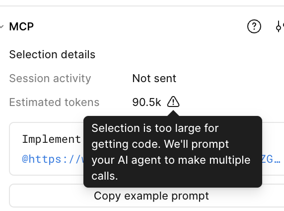

# 本地 Figma MCP Server：价值、配置与使用限制

本文说明在 AI 辅助前端开发中，**本地 Figma Desktop MCP Server** 的作用、如何配置，以及**选区过大时的 token 限制**与应对方式。

---

## 一、为什么本地 Figma MCP 很重要

| 价值 | 说明 |
|------|------|
| **设计上下文进 IDE** | 通过 Model Context Protocol，把 Figma 里的变量、组件、布局等信息直接交给 Cursor 等客户端里的 AI，减少「凭感觉猜 UI」 |
| **与设计稿对齐** | 可针对**当前选中**的画板/图层或**带 node-id 的链接**拉取设计上下文，空状态、间距、文案等更容易一次做对 |
| **与设计系统一致** | 可配合 Code Connect，让生成代码尽量复用仓库里已有组件，而不是凭空造一套 |
| **迭代更快** | 改设计 → 在 Figma 里选中 → 让 AI 按最新节点实现，比反复截图、口述规格更省沟通成本 |
| **相对在线 MCP 更省心** | **Figma 远程/在线 MCP**（如 `https://mcp.figma.com/mcp`）通常受 **调用次数 / 配额** 限制，且与团队计划、席位相关；超出后工具不可用或需等待。**本地桌面 MCP** 走本机与桌面应用通信，不占用同一条远程配额链路，适合高频、反复拉设计上下文的日常开发（具体政策以 Figma 官方说明为准）。 |

> 本项目在 `.cursor/mcp.json` 中已配置 `Figma Desktop`，地址为 `http://127.0.0.1:3845/mcp`（需先在 Figma 桌面端启用服务）。

---

## 二、如何配置本地 Figma MCP Server

以下内容整理自 [Figma Developer Docs：Desktop server (using desktop app)](https://developers.figma.com/docs/figma-mcp-server/local-server-installation/)，以官方为准；若有更新请以官网为准。

### 前置条件

- 使用 **Figma 桌面版**（浏览器版无法使用本地 MCP）
- 使用支持 MCP 的编辑器（如 **Cursor**、VS Code、Claude Code 等）
- 将 Figma 桌面应用**更新到最新版本**
- **对该设计文件具备足够权限**：后续步骤需要进入 **Dev Mode** 并在 Inspect 中启用 MCP。若你对文件仅有「可查看」等受限权限，可能无法使用 Dev Mode 或相关能力；需由文件所有者为你授予 **可编辑** 或与团队策略一致的 **Dev 席位 / 协作权限**（以 Figma 当前权限模型为准）。无权限时请先申请访问或改用你有权编辑的副本。

### 步骤 1：在 Figma 中启用桌面 MCP Server

1. 用 **Figma 桌面应用**打开或创建一个 **Design** 文件  
2. 切换到 **Dev Mode**（工具栏底部切换，或快捷键 `Shift + D`）  
3. 在 **Inspect（检查）** 面板中找到 **MCP server** 区域  
4. 点击 **Enable desktop MCP server**  
5. 确认底部提示服务已启用；本地地址一般为：  
   **`http://127.0.0.1:3845/mcp`**

### 步骤 2：在 Cursor 中连接 MCP

1. 打开 **Cursor → Settings → Cursor Settings → MCP**  
2. 点击 **Add new global MCP server**（或按项目使用 `.cursor/mcp.json`）  
3. 增加类似配置（名称可自定义，与官方示例一致时可写 `figma-desktop`）：

```json
{
  "mcpServers": {
    "Figma Desktop": {
      "url": "http://127.0.0.1:3845/mcp"
    }
  }
}
```

4. 保存后确认 MCP 列表中该服务为已连接状态  

更多说明见：[Cursor 文档 - Model Context Protocol](https://docs.cursor.com/context/model-context-protocol)。

### 步骤 3：如何把设计交给 AI

**方式 A：基于当前选中**

1. 在 Figma 桌面端选中一个 Frame 或图层  
2. 在 Cursor 里说明需求（例如：按当前选中实现某页面/组件）

**方式 B：基于链接**

1. 在 Figma 中复制带 `node-id` 的设计链接  
2. 在提示词里粘贴链接，并说明要实现的内容  

> AI 无法像浏览器一样「打开」该 URL，但 MCP 会从链接中解析 **node-id**，从而定位到对应节点。

### 步骤 4（可选）：桌面端 MCP 设置

在 Figma Inspect 面板的 MCP 区域可打开设置，例如：

- **图片资源**：占位符 / 下载到项目 / 本地服务（localhost 资源链接）等  
- **Code Connect**：是否在响应中包含映射，以便复用代码库组件  

---

## 三、本地 MCP 的使用限制（选区过大 / Token 上限）

在 Figma 桌面端 MCP 面板中，会显示当前选区的 **Estimated tokens**（估算 token 数）。当选区过大时，会出现**警告**，含义大致为：

> **Selection is too large for getting code. We'll prompt your AI agent to make multiple calls.**  
> （选区过大，无法在一次请求中完整获取代码上下文；系统将提示 AI 分多次调用。）

示意（本项目截图）：



**对开发者的实际影响：**

- 单次 `get_design_context`（或同类工具）能承载的上下文有限，**一整屏复杂页面**可能达到数万 token（例如截图中约 **90.5k**），容易触发上述限制或导致质量下降、超时。  
- 即使工具提示「让 AI 多次调用」，仍建议在**流程上主动拆小**，而不是依赖一次超大选区。

---

## 四、如何绕开限制：按节点拆分，让 AI 分步实现

建议把大页面拆成**多个独立、边界清晰的 Figma 节点**，每次只让 AI 针对**一个节点**（或一小簇组件）生成或对齐代码。

### 实践建议

| 做法 | 说明 |
|------|------|
| **按 Frame 拆分** | 每个主要区域（顶栏、侧栏、对话区、空状态、输入区等）单独成 Frame，并命名清楚 |
| **一次一个 node-id** | 在提示词里明确：`请根据 node-id=xxx 实现 xxx 区域`，避免「整页一个框选」 |
| **先结构后细节** | 第一轮只做布局与组件占位；第二轮再针对子 Frame 做样式与交互 |
| **共用 token 的组件单独选** | 按钮、输入框、卡片等可在设计里单独 Frame，便于小范围拉上下文 |
| **与项目规则配合** | 已有设计 token、组件库 MCP 时，小选区 + 规则往往比「整页截图式」更高效 |

### 示例工作流

1. 在 Figma 中把「对话面板 - 空状态」做成独立 Frame，复制其链接或记下 node-id。  
2. 在 Cursor 中：`请根据以下 Figma 节点实现空状态（附链接）…`  
3. 再选中「对话面板 - 消息列表 + 输入区」另一个 Frame，第二轮实现。  
4. 最后在应用里组装页面，而不是要求 AI 一次吃掉整页设计树。

---

## 五、参考链接

- [Figma：Desktop MCP Server 安装与配置](https://developers.figma.com/docs/figma-mcp-server/local-server-installation/)  
- [Figma：Remote MCP Server](https://developers.figma.com/docs/figma-mcp-server/remote-server-installation/)（在线方式；配额与计划以官方文档为准）  
- [Figma Help：Figma MCP collection](https://help.figma.com/hc/en-us/articles/35281186390679-Figma-MCP-collection-How-to-setup-the-Figma-desktop-MCP-server)  
- [Model Context Protocol](https://modelcontextprotocol.io/)  
- [Cursor：Model Context Protocol](https://docs.cursor.com/context/model-context-protocol)

---

*文档随 Figma / Cursor 产品更新可能需修订；配置请以官方文档为准。*
